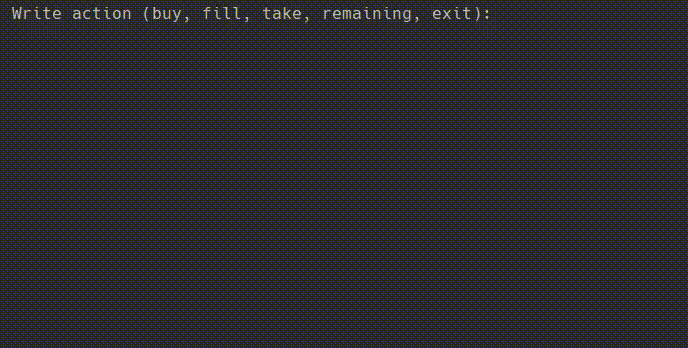

# Coffee-Machine

Coffee Machine written in Kotlin



What can be better than a cup of coffee during a break? A coffee that you don’t have to make yourself. 
It’s enough to press a couple of buttons on the machine and you get a cup of energy. 
In this project, I have built a coffee machine simulator. 
The machine works with typical products: coffee, milk, sugar, and plastic cups; if it runs out of something, it shows a notification.
You can get three types of coffee: espresso, cappuccino, and latte. Since nothing’s for free, it also collects the money.

## Requirements
- Download [JDK][openjdk-14] and extract
- Add JDK `/bin` directory to your PATH

## Usage
- Download [release]
- Run where you placed `Coffee-Machine.jar`:
```sh
java -jar Coffee-Machine.jar
```

## Build
- Install [Kotlin compiler][kotlinc], same as JDK (see requirements)
- Run from project directory:
```sh
kotlinc src/file/Coffee-Machine.kt -include-runtime -d Coffee-Machine.jar
```

[openjdk-14]: http://jdk.java.net/14/
[kotlinc]: https://github.com/JetBrains/kotlin/releases/latest
[hyperskill]: https://hyperskill.org/projects/196
[release]: https://github.com/royalpinto007/Coffee-MAchine/releases
